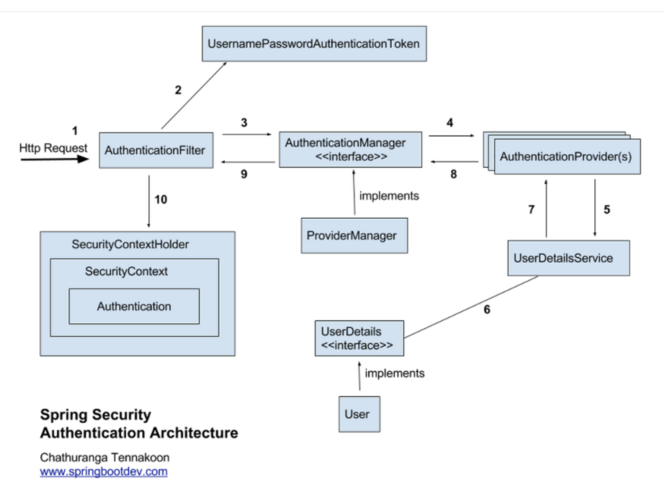
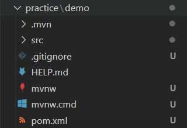
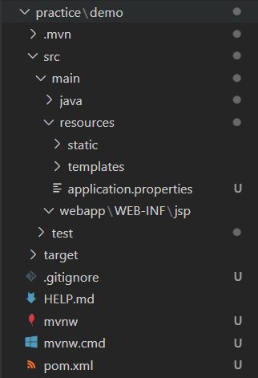
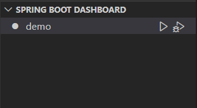
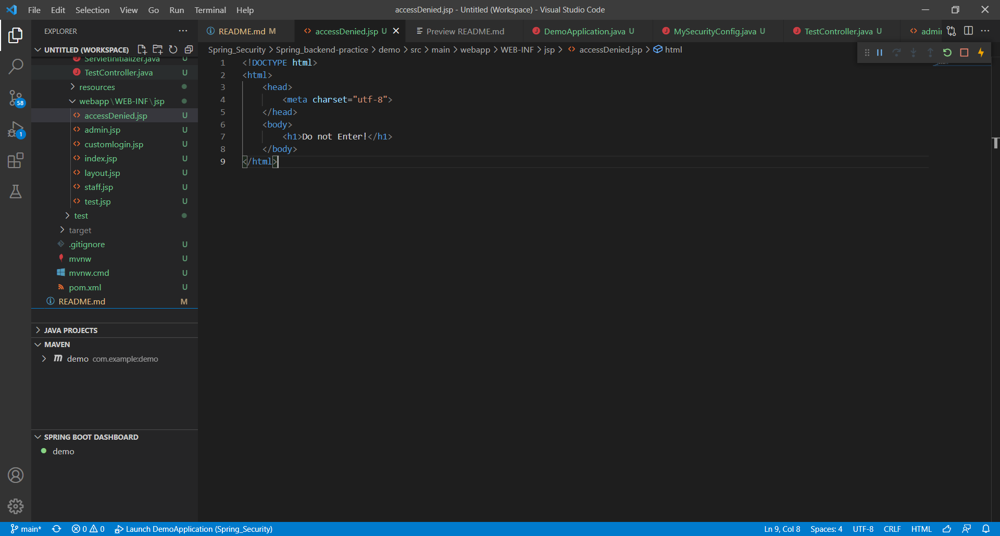
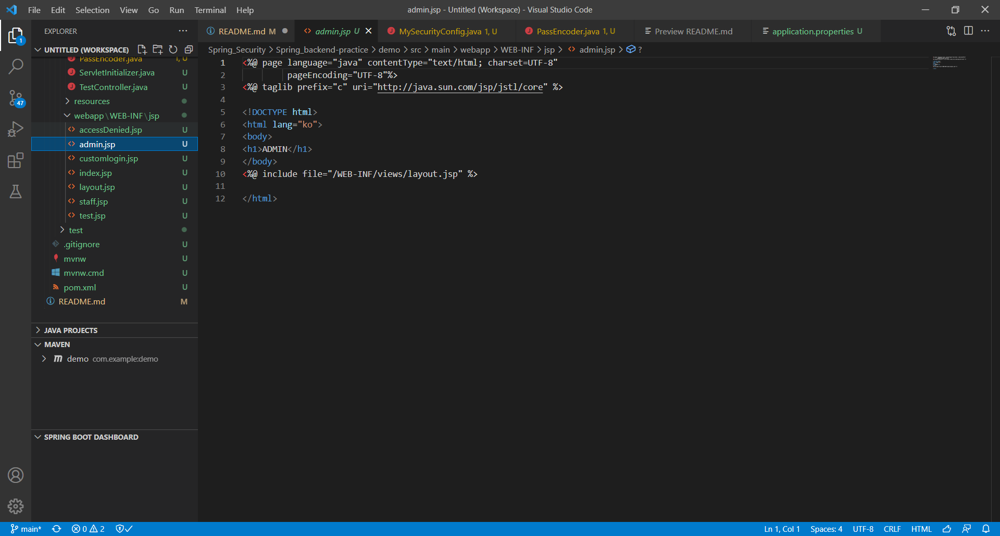
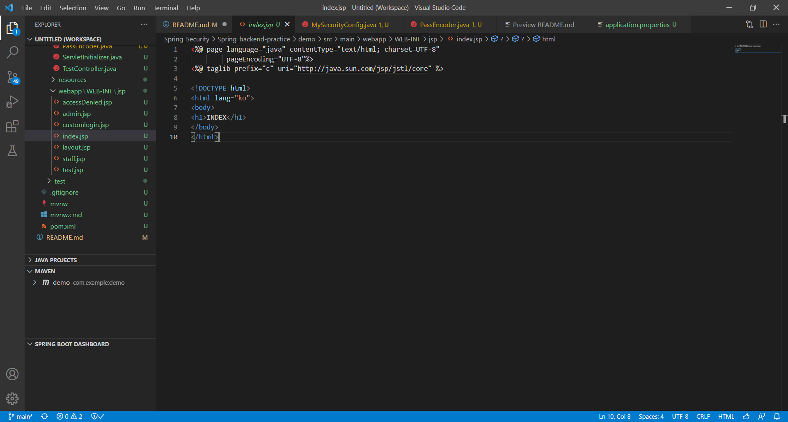
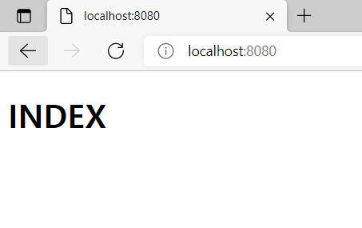
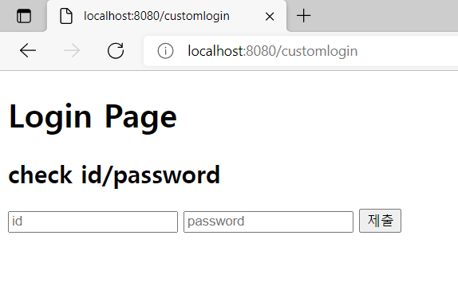
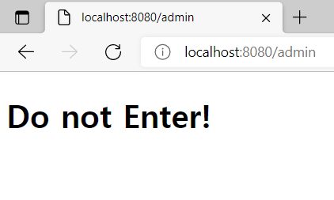

# Spring Security 를 이용한 웹 인증 서버 구현

## 목차
	1. Spring security란?
	2. Spring security의 구조
	3. 실습 환경
	4. 실습
 
 

### 1. Spring Security란?
Spring 기반의 애플리케이션의 보안(인증과 권한, 인가 등)을 담당하는 스프링 하위 프레임워크이다.
 
 

### 2. Spring Security의 구조

- 인증(Authentication): 해당 사용자가 본인이 맞는지를 확인하는 절차
- 인가(Authorization): 인증된 사용자가 요청한 자원에 접근 가능한지를 결정하는 절차 

 기본적으로 인증 절차를 거친 후에 리소스에 대한 접근 권한이 있는지 인가 절차를 진행한다. 이러한 인증과 인가를 위해 Principal을 아이디로, Credential을 비밀번호로 사용하는 인증 방식을 사용한다. 

- Principal(접근 주체): 보호받는 Resource에 접근하는 대상
- Credential(비밀번호): Resource에 접근하는 대상의 비밀번호

 
 

### 3. 실습 환경
(1) 준비물
- [Visual Studio Code](https://code.visualstudio.com/)
- [Java Development Kit (JDK)](https://www.microsoft.com/openjdk)
- [Extension Pack for Java](https://marketplace.visualstudio.com/items?itemName=vscjava.vscode-java-pack)
- [Spring Boot Extension Pack](https://marketplace.visualstudio.com/items?itemName=pivotal.vscode-boot-dev-pack)

(2) 환경 변수 설정
  
JDK의 bin폴더는 java를 이용해 개발할 수 있는 kit의 실행 폴더이다. 환경 변수 설정을 함으로써 visual studio에서 java 개발 kit를 인식할 수 있게 된다.
  JDK 설치 이후 설치한 폴더의 bin폴더까지 들어간 다음, Path를 복사해준다.
 

 
 
(복사된 Path) C:\Program Files\microsoft-jdk-11.0.13.8.1-windows-x64\jdk-11.0.13+8\bin
 
 
이후 ​내 PC 우클릭 -> 속성 -> 고급시스템 설정을 클릭한다.
 
 

 
 
그러면 다음과 같은 창을 볼 수 있다. 환경 변수를 클릭해준다.
 
 

 
 
다음과 같은 창에서 (시스템 변수) 새로 만들기를 클릭한다. 
 
 

 
 
복사했던 Path를 변수 값에 넣고 변수 이름을 다음과 같이 설정해주고 확인을 클릭한다.
 
 

 
 
다음과 같은 창이 나오면, 시스템 변수에서 다음과 같이 Path를 찾아준다음 더블 클릭한다.
 
 

 
 
그러면 다음과 같은 창이 나오고 새로 만들기를 클릭해준다음, %JAVA_HOME%를 입력 후 창과 같이 되면 확인을 클릭한다.
 
 

 
 
cmd창에 java -version 명령어 입력 후 다음과 같이 나오면 환경 변수 설정이 완료된다.
 
 

 
 
이제 실습을 위한 환경이 준비되었다.
 
 

### 4. 실습
Visaul studio에서 Ctrl + P를 누르고 '> Spring Initializr: Create a Maven Project 를 입력 후 클릭해준다.
2.6.2 -> java -> com.example -> demo -> War -> 11 -> Spring Web, Spring Security 를 추가한다음 폴더를 설정해 프로젝트를 생성해준다.
 
 

 
 
다음과 같은 경로를 확인할 수 있다.
여기서, pom.xml은 이 프로젝트에 대한 dependency 설정이 담긴 파일이다. 우리가 아까 추가했던 Spring Web, Spring Security에 대한 dependency를 다음과 같이 볼 수 있고 추가로 필요한 dependency를 추가할 수도 있다.
 
 

 
 
우리는 jsp를 이용할 것이므로 dependency에 다음과 같은 구문을 추가한다.
 
 

 
 
다음과 같이 프로젝트의 main 폴더 밑에 webapp\WEB-INF\jsp 폴더를 만들어준다. 이 폴더에 jsp파일을 넣어줄 것이다.
 
 

 
 
그런 다음, main\resources 폴더에 있는 프로젝트의 설정 파일인 application.properties를 수정해준다.
 
 

 
 
우리는 webapp\WEB-INF\jsp 경로에 있는 view를 브라우저로 전달할 것이므로 spring.mvc.view.prefix=/WEB-INF/jsp/란 웹 서버에서 사용자의 브라우저로 view를 전달할 때, view 경로의 prefix에 자동적으로 /WEB-INF/jsp/ 를 붙여준다는 말이고, spring.mvc.view.suffix=.jsp 는 suffix에 .jsp를 붙여준다는 설정해준다.
 
 

 
 
그러면 우리는 jsp를 이용해 view를 사용자의 브라우저에 띄워줄 수 있게 된다.
 
visual code의 좌측 하단 다음과 같은 Spring Boot Dashboard을 찾을 수 있다.
  
play button 클릭 시 demoWebapplication이 실행된다. 
 
 

 
 
Spring Security defendency를 추가해줬기 때문에 Spring Security의 인증 페이지를 볼 수 있는데, 우리는 이 인증에 대한 세부 설정을 바꿀 것이다.
 
 

 
 
다음과 같은 경로에 MySecurityConfig.java파일을 만든다. 이때, 이 WebSecurity에 대한 설정파일은 DemoApplication.java랑 같은 폴더이거나 하위 폴더여야만 한다.
 
 

 
 
MySecurityConfig.java를 통해 다음과 같은 설정을 할 수 있다.
 
 

 
 
비밀번호를 암호화하기 위한 encode 설정을 위해 다음과 같은 경로에 PassEncoder.java를 생성해준다. 다음과 같은 설정으로서 비밀번호가 암호화되어 서버에 저장된다.
 
 

 
 
우리는 아까 설정했던 WebSecurity가 잘 작용하는지 test를 할 것이다.
다음과 같은 파일을 만든다.
 
 

 
 
Controller에 대한 설정이 담겨져 있다. 이도 마찬가지로 DemoApplication.java 와 같은 폴더이거나 하위 폴더에 존재해야 한다. Controller란 브라우저에서 요청한 url에 대해서 그 url에 해당되는 view를 보내주게 할 수 있다.
 
 
그리고 그에 맞는 view들을 webapp\WEB-INF\jsp 폴더에 다음과 같이 만든다.
 
 

 
 
accessDenied.jsp : 접근 불가 시 보여줄 페이지
 
 

 
 
admin.jsp : admin으로 접속 시 보여줄 페이지
 
 

 
 
//customlogin.jsp : login page로 login을 하기 위한 페이지
 
 

 
 
index.jsp : login 성공 시 제일 먼저 보여줄 페이지
 
 

 
 
layout.jsp : logout 버튼에 대한 container가 담겨져 있어 다른 페이지에 include해서 사용할 수 있다.
 
 

 
 
staff.jsp : staff로 접근 시 보여줄 페이지
 
 

 
 
test.jsp : model(jstl)이 잘 작동하는 지 보여줄 페이지
 
 
이제 아까와 같이 dashboard를 이용해 application을 실행하고 MySecurityConfig에서 설정했던 id:staff 비번:1234, id:admin 비번:1234를 이용해 test를 해주면 된다.
 
 

 
 
처음 접속 시 기본 페이지인 index 페이지를 보여준다.
 
 

 
 
요청 url이 Customlogin 이면 login을 하기 위한 페이지를 보여준다.
 
 

 
 
아이디: staff, 비번:1234로 로그인 시 index페이지로 들어가며
 
 

 
 
url을 staff로 요청 시 다음과 같이 staff가 볼 수 있는 페이지가 뜬다.
 
 

 
 
하지만 admin으로 요청 시 접근이 제어되어 다음과 accessDenied 페이지를 보게 된다.
 
 

 
 
반면, admin 계정으로 갔을 때는 staff, admin 페이지 다 접속이 가능하다.
 
이로써 우리는 페이지에 따라 권한을 설정하고 권한에 따라 접근을 제한하는 Spring Security를 할 수 있게 되었다.